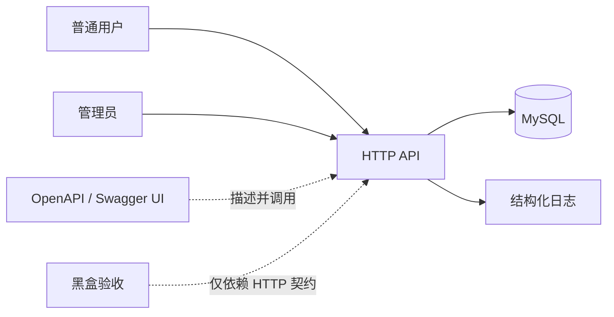
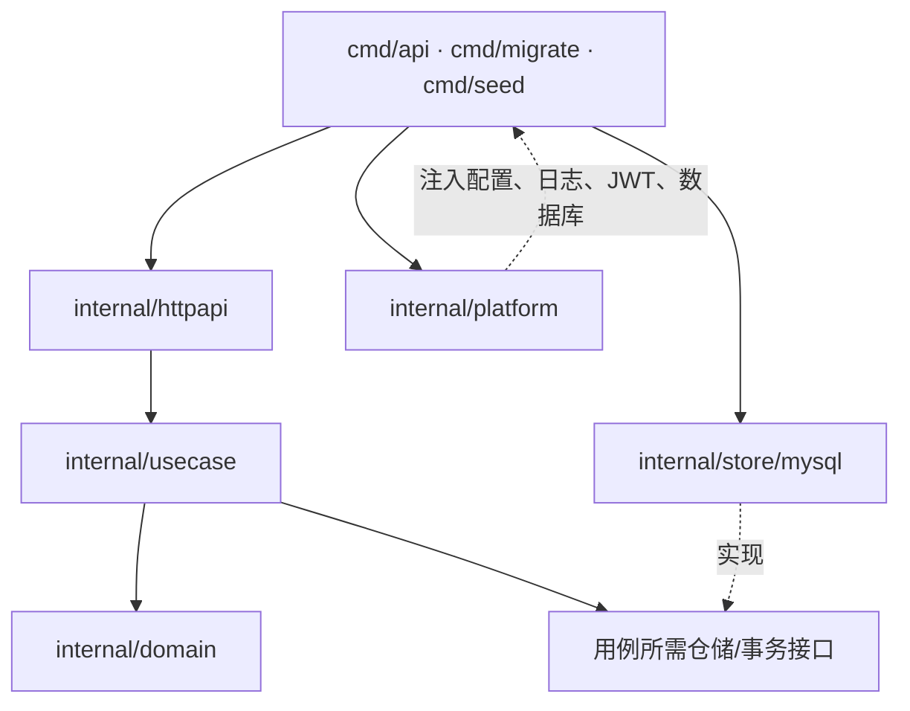
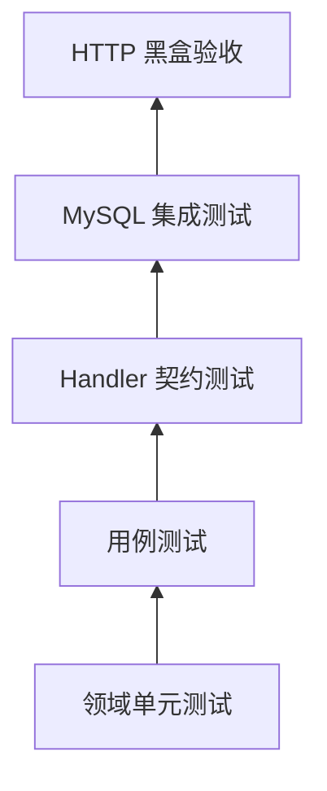

# 系统架构

## 1. 架构目标

本项目采用单个 Go 模块内的模块化单体。目标不是展示框架数量，而是让 HTTP、用例、领域、持久化和运行时边界清晰可测，并能在一个进程、一个 MySQL 数据库中完成“发帖—互动—举报—治理—审计”的闭环。

第一版优先保证：

- 业务身份只来自验证后的 JWT；
- 权限、事务和状态迁移集中在用例层；
- 领域规则不依赖 HTTP、数据库或第三方库；
- 数据约束与应用校验互相补强；
- 默认测试不需要 Docker，真实 MySQL 语义由显式集成测试验证；
- `reference` 与 `starter` 只共享契约，不共享业务代码。

真实行情、交易、直播、支付、AI、Push、WebSocket、Redis、消息队列、Kubernetes 和微服务不属于第一版。

## 2. 系统上下文



普通用户完成注册、登录、入圈、发帖、评论、回复、通知和举报；管理员额外处理举报、恢复内容并查询审计。系统不调用行情供应商或交易平台。

## 3. 分层与依赖方向



依赖只能朝领域和用例方向收敛：

| 层 | 负责 | 不负责 |
| --- | --- | --- |
| `cmd` | 读取配置、装配依赖、启动和优雅关闭 | 业务判断、SQL |
| `httpapi` | 路由、媒体类型、Body 限制、JSON DTO、身份提取、错误到 HTTP 的映射 | 事务、对象权限、直接查库 |
| `usecase` | 业务流程、权限、事务边界、幂等、仓储接口 | HTTP 状态码、SQL 细节 |
| `domain` | 实体、值约束、状态、不变量、稳定业务错误 | 数据库标签、网络、日志 |
| `store/mysql` | SQL、扫描、唯一键/外键映射、事务和行锁 | 返回 HTTP 响应、重新发明领域规则 |
| `platform` | 配置、日志、JWT、密码哈希、数据库连接、迁移基础设施 | 内容社区业务流程 |

仓储接口应由使用它的用例一侧定义，避免“为了可能的数据库替换”建立庞大通用仓储框架。

## 4. 一次请求的调用链

```text
客户端
  → ServeMux 路由与 HTTP 中间件
  → Request ID / 日志 / 恢复 / JWT 身份
  → Handler 严格解析 JSON 和路径参数
  → Use Case 校验角色、对象权限和状态
  → Repository 或 Transaction 执行 SQL
  → 领域错误映射为统一错误信封
  → JSON 响应
```

Handler 只把协议输入变成用例输入。认证中间件验证 JWT 后只采用 `sub`，再加载当前 active 数据库用户；Token 中的 role claim 与客户端提交的 `user_id`、`role` 或资源归属都不可信。作者、举报者和通知所有者来自当前数据库身份。

未知 JSON 字段、尾随 JSON、超大 Body 和错误 `Content-Type` 在进入用例前被拒绝。这样领域测试无需理解 HTTP 解析细节，用例也不会接收到模棱两可的输入。

所有业务 ID 在 MySQL 为有符号 `BIGINT`，在 Go 为正数 `int64`，在 OpenAPI 为 `integer/int64` 且 `minimum: 1`。路径、查询和请求体中的 ID 统一解析；0、负数、超出 int64 或非十进制输入返回 `400 invalid_request`。系统不维护 UUID 与 BIGINT 的第二套映射。

## 5. 事务边界

事务只覆盖必须原子完成的不变量，不把 JSON 编解码、密码哈希或日志写入放在数据库事务中。

| 用例 | 同一事务内的写入 | 原因 |
| --- | --- | --- |
| createPost | 帖子及其幂等字段、1～5 条证券关系 | 不允许半成品；同键重放不能重复副作用 |
| createComment | 评论及其幂等字段；必要时创建一条通知 | 接收者不能看到不存在回复的通知，重放不能重复通知 |
| 处理举报 | 先锁目标，再按 ID 锁定同目标 pending 举报、更新状态、必要时隐藏目标并写审计 | 统一锁序避免死锁；一次隐藏收口全部待办 |
| 恢复内容 | 校验 `expected_moderation_version`、恢复可见、递增版本并写审计 | 任何治理变化都可追溯，旧重试不能覆盖新治理 |

治理事务统一先锁帖子/评论，再按 report.id 锁举报；遇到 MySQL deadlock/lock timeout 只允许整事务有界重试。后到请求重新读取终态：相同决策返回既有 200，不同决策返回 `409 report_already_decided`。恢复使用独立 `moderation_version`：紧邻重试可识别，hidden→visible→hidden 后的旧重试返回 `409 moderation_version_conflict`，避免 ABA。

## 6. 身份与权限

JWT 只承载最少身份信息，并严格校验允许的签名算法、发行者、受众和过期时间。验证后按 `sub` 加载用户；不存在或 `status=disabled` 返回 `401 unauthenticated`。全局角色从数据库读取，Token role claim 不参与授权；圈子成员、内容作者、通知所有者同样通过当前数据判断。

权限检查顺序保持一致：

1. 验证是否已认证；
2. 按 sub 加载 active 用户并验证数据库角色；
3. 加载目标资源；
4. 验证成员、作者或所有者关系；
5. 验证资源当前状态；
6. 执行业务动作。

普通读取/举报遇到不存在、deleted 或 hidden 内容统一 `404 not_found`；目标可见但调用者不是作者时返回 `403 forbidden`；非成员创作返回 `403 membership_required`。所有 Handler 使用同一映射。

## 7. 数据读取与稳定分页

帖子、评论和通知列表都使用游标分页，并按 `(created_at, id)` 形成稳定的全序。下一页条件与排序方向必须严格对应；只按时间排序会在时间相同或并发插入时造成重复、遗漏。

列表查询只返回当前可见且未删除的内容。管理员治理视图是否包含隐藏内容由专用查询明确表达，不在普通列表中增加隐式开关。

## 8. 错误契约

所有错误使用统一信封：稳定 `code`、可读 `message` 和当前 `request_id`。至少覆盖：

| 场景 | 确定结果 |
| --- | --- |
| JSON 语法错误或尾随第二个值 | `400 invalid_json` |
| 未知字段或请求形状错误 | `400 invalid_request` |
| ID 为 0、负数、非十进制或超出 int64 | `400 invalid_request` |
| restore 路径的 `targetType` 不是 `post/comment` | `400 invalid_request` |
| 游标篡改、过期或与筛选条件不匹配 | `400 invalid_cursor` |
| Body 过大 | `413 payload_too_large` |
| 媒体类型错误 | `415 unsupported_media_type` |
| Token 缺失/无效/过期，或 sub 用户不存在/disabled | `401 unauthenticated` |
| 登录 email 不存在或密码错误 | `401 invalid_credentials` |
| 已知可见资源的非作者动作、普通用户治理 | `403 forbidden` |
| 非成员创建/更新帖子或评论 | `403 membership_required` |
| 资源不存在、deleted 或 hidden | `404 not_found` |
| 注册 email 已存在 | `409 email_taken` |
| createPost/createComment 同键异请求 | `409 idempotency_conflict` |
| 帖子更新使用过期正文版本 | `409 version_conflict` |
| 恢复请求使用过期治理版本 | `409 moderation_version_conflict` |
| 对 hidden 内容执行作者修改/删除，或回复 hidden/deleted 父评论 | `409 content_not_editable` |
| 已终态举报收到不同决策 | `409 report_already_decided` |
| 从未隐藏或作者已删除的恢复 | `409 content_not_restorable` |
| 普通字段、数量或枚举不合法 | `422 validation_failed` |
| 用户举报自己的内容 | `422 self_report_forbidden` |
| 跨帖父评论或二级回复 | `422 parent_comment_invalid` |
| 未分类数据库或运行时错误 | `500 internal_error` |

领域和用例返回稳定错误类型，HTTP 层统一映射；仓储层只翻译它能够确定的数据库事实，如唯一键冲突和外键失败。

## 9. 运行时与安全

- `/healthz` 只表示进程能够响应，不访问数据库；
- `/readyz` 用短超时 Ping 数据库，失败时返回未就绪；
- HTTP Server 配置读取、Header、写入和空闲超时，并限制请求 Body；
- API 响应统一设置 `no-store`、`nosniff` 与禁止框架嵌入的 CSP，避免认证数据被中间缓存或误作可执行内容；
- 收到终止信号后停止接收新请求，在截止时间内完成已有请求并关闭连接池；
- 密码只保存专用哈希结果，登录失败不泄露 email 是否存在；
- 日志记录 Request ID、方法、路由、状态和耗时，不记录密码、Token、Authorization Header 或完整正文；
- 配置来自环境，示例文件只给变量名和安全占位符。

## 10. 测试架构



- 领域测试验证状态与纯规则；
- 用例测试以小型 fake 验证权限、调用顺序和事务分支；
- Handler 测试使用 `httptest` 验证协议，不启动真实端口；
- `integration` build tag 连接真实 MySQL，验证外键、唯一键、事务、索引路径和行锁；
- `acceptance` build tag 只通过 HTTP 和 OpenAPI 验证完整业务链；
- 默认 `go test ./...` 不依赖 Docker，并在每个学习阶段保持绿色。

测试替身只模拟当前用例所需行为，不建设通用内存数据库。SQL 语义不能由 fake 或 SQLite 代替验证。

## 11. 双轨交付

`reference` 和 `starter` 各自拥有 `cmd/` 与 `internal/`，Go 的 `internal` 可见性帮助阻止跨轨导入。`contracts/` 保存可共享的 OpenAPI 和黑盒场景；`docs/learning/` 说明实现顺序，但不泄漏必须照抄的内部代码。

学习者可以采用不同的内部类型和函数名，只要依赖方向、外部契约、数据不变量、安全边界和验收结果一致。

## 12. 可复现交付链

`compose.yaml` 把运行依赖固定为 `MySQL healthy → migrate completed → seed completed → API ready → Swagger`。迁移和 Seed 是一次性容器，失败会阻止 API 接流量；Swagger 与 API 通过同一 Nginx 源访问 `/api/v1`，因此不需要为教学页面放宽 CORS。CI 使用同样的迁移、Seed 和环境变量契约，并以显式 build tag 隔离真实 MySQL 与进程外 HTTP 验收，使默认单元测试仍不依赖 Docker。
