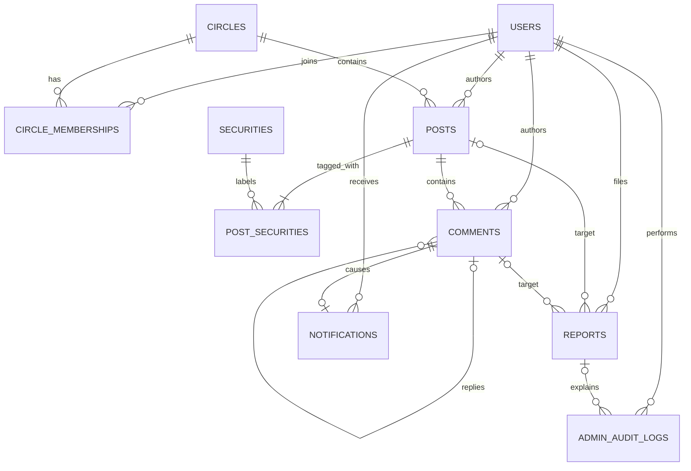

# 数据模型与约束

## 1. 建模原则

数据模型服务于业务不变量，而不是为了展示表的数量。第一版遵循以下原则：

- 身份归属使用已认证用户的主键，不接受客户端指定作者或所有者；
- 数据库唯一键、外键和检查约束保护结构性事实，应用层保护跨行和权限规则；
- `posts/comments.visibility` 只表达 `visible/hidden`，`deleted_at` 独立表达作者删除；
- 举报目标使用互斥外键，不使用无法建立外键的“目标类型 + 任意 ID”多态引用；
- 列表使用 `(created_at, id)` 稳定排序，并让索引匹配过滤条件和排序方向；
- 时间统一以 UTC 写入，API 层再使用带时区的 RFC 3339 表示；
- 所有业务 `id`、`*_id`、`parent_id` 和 `handled_by` 在 MySQL 使用有符号 `BIGINT`，Go 使用正数 `int64`，OpenAPI 使用 `integer/int64` 且最小值为 1；数据库与协议共同限定在 `math.MaxInt64` 内，不使用 UUID；
- 自增业务 ID 必须限制在 `math.MaxInt64` 内，保证 MySQL 值可无损进入 Go `int64`；可空外键使用可空 int64 表达；
- 主业务表使用单调 int64 主键作为稳定的次排序键，不能把它解释为业务时间。

本文按当前 MySQL Migration 的实际列名描述持久化模型。`request_id` 和 `idempotency_key` 是字符串标识，不属于上述业务 ID；分页游标可以编码 int64 排序键，但客户端仍不得解析。

## 2. 关系总览

帖子至少有一个证券标签，因此图中 `POSTS` 到 `POST_SECURITIES` 为一对一至多。数据库外键只能防止无效关联，“至少一个且最多五个”由创建帖子的同一事务保证。

## 3. 表职责

### 3.1 `users`

| 字段 | 含义与约束 |
| --- | --- |
| `id` | `BIGINT` 自增主键 / Go 正数 `int64` |
| `email` | 规范化后的 email，唯一且不可为空；列使用 `utf8mb4_0900_bin`，数据库不额外忽略重音或扩大等价关系 |
| `password_hash` | 专用密码哈希结果，永不保存或记录明文 |
| `display_name` | 展示名称，最多 80 个字符；外部 UserSummary 使用同名字段 |
| `role` | 只允许 `user` 或 `admin` |
| `status` | `active` 或 `disabled`；停用用户不能继续认证 |
| `created_at`, `updated_at` | 创建与修改时间 |

`uq_users_email(email)` 是并发注册的最终裁判。应用层可以先检查以提供友好提示，但仍必须把数据库唯一键冲突翻译成稳定冲突错误。JWT 验证后还要加载当前用户；不存在或 `disabled` 返回 `401 unauthenticated`，不能仅相信 Token 中旧的角色信息。

### 3.2 `circles`

| 字段 | 含义与约束 |
| --- | --- |
| `id` | `BIGINT` 自增主键 / Go 正数 `int64` |
| `slug` | 稳定、唯一的公开标识 |
| `name` | 展示名称，当前迁移同样唯一 |
| `description` | 简短介绍 |
| `status` | `active` 或 `archived` |
| `created_at`, `updated_at` | 创建与修改时间 |

第一版圈子均为公开圈子，不预建圈主、审批或邀请字段。加入只是创建成员关系，不代表拥有管理权限。

### 3.3 `circle_memberships`

| 字段 | 含义与约束 |
| --- | --- |
| `circle_id` | 外键指向 `circles` |
| `user_id` | 外键指向 `users` |
| `joined_at` | 入圈时间 |

复合主键为 `(circle_id, user_id)`。重复加入被视为幂等成功；并发请求最终由复合主键收敛为一条关系。

### 3.4 `securities`

| 字段 | 含义与约束 |
| --- | --- |
| `id` | `BIGINT` 自增主键 / Go 正数 `int64` |
| `market` | 虚构市场标识，使用 `VARCHAR(16)` 以容纳原创 Seed |
| `code` | 虚构证券代码 |
| `name` | 虚构名称 |
| `status` | `active` 或 `inactive`；只有 active 可用于新帖子 |
| `created_at` | 创建时间 |

`uq_securities_market_code(market, code)` 保证同一虚构市场内代码唯一。`inactive` 只禁止新关联，不删除历史帖子标签。此表是静态教学目录，不保存价格、涨跌或交易数据。

### 3.5 `posts`

| 字段 | 含义与约束 |
| --- | --- |
| `id` | `BIGINT` 自增主键 / Go 正数 `int64` |
| `circle_id` | 外键指向所属圈子 |
| `author_id` | 外键指向真实作者 |
| `title` | 帖子标题，最多 120 个字符 |
| `body` | 帖子正文，长度由领域规则限制 |
| `visibility` | `visible` 或 `hidden`，只表示治理可见性 |
| `moderation_version` | 治理可见性版本，初始为 1；每次隐藏/恢复递增，用于防止 ABA 旧重试覆盖新治理 |
| `version` | 乐观并发版本，初始为 1 |
| `idempotency_key` | 可空；createPost 由客户端提供的幂等键 |
| `request_hash` | 可空；规范化业务输入的 SHA-256 十六进制摘要 |
| `created_at`, `updated_at` | 创建与修改时间 |
| `deleted_at` | 作者软删除时间，可为空；不改写 `visibility` |

`idempotency_key` 与 `request_hash` 都使用 ASCII binary collation，并由 CHECK 保证同时为空或同时非空；因此 `ABC` 与 `abc` 是两个不同的键。`uq_posts_author_idempotency(author_id, idempotency_key)` 是 `createPost` 的并发最终裁判。相同用户、相同键、相同 `request_hash` 回放原 `201` 结果；相同键但请求哈希不同返回 `409 idempotency_conflict`。哈希覆盖方法、路径、`circle_id`、规范化标题/正文和排序后的 `security_ids`，不能包含 Request ID 或时间戳。

普通列表只返回 `visibility='visible' AND deleted_at IS NULL`。治理隐藏只改 `visibility`；作者删除只写 `deleted_at`。管理员恢复只允许 `visibility: hidden → visible` 且 `deleted_at IS NULL`，绝不能清空 `deleted_at`。

### 3.6 `post_securities`

| 字段 | 含义与约束 |
| --- | --- |
| `post_id` | 外键指向 `posts` |
| `security_id` | 外键指向 `securities` |
| `created_at` | 建立关系的时间 |

复合主键为 `(post_id, security_id)`，防止同一帖子重复标签。创建帖子前校验请求的 `security_ids` 含 1～5 个不重复 active 证券，再在同一事务中写帖子和全部关系。

### 3.7 `comments`

| 字段 | 含义与约束 |
| --- | --- |
| `id` | `BIGINT` 自增主键 / Go 正数 `int64` |
| `post_id` | 外键指向所属帖子 |
| `author_id` | 外键指向真实作者 |
| `parent_id` | 回复的顶级评论，可为空 |
| `body` | 评论正文 |
| `visibility` | `visible` 或 `hidden`，只表示治理可见性 |
| `moderation_version` | 治理可见性版本，初始为 1；隐藏/恢复时递增 |
| `idempotency_key` | 可空；createComment 使用的幂等键 |
| `request_hash` | 可空；规范化方法、路径、正文和外部 `parent_comment_id` 的请求哈希 |
| `created_at`, `updated_at` | 创建与修改时间 |
| `deleted_at` | 作者软删除时间，可为空 |

`parent_id IS NULL` 表示顶级评论，否则表示一级回复。创建回复时必须读取父评论并验证：父评论属于同一帖子、父评论自身没有父级、父评论与帖子均为 `visibility='visible' AND deleted_at IS NULL`。普通外键无法表达这些跨行条件，因此由用例在事务内校验。`uq_comments_author_idempotency(author_id, idempotency_key)` 只服务 `createComment`，确保重放不会重复评论或通知。

### 3.8 `reports`

| 字段 | 含义与约束 |
| --- | --- |
| `id` | `BIGINT` 自增主键 / Go 正数 `int64` |
| `reporter_id` | 外键指向举报者 |
| `post_id` | 被举报帖子，可为空 |
| `comment_id` | 被举报评论，可为空 |
| `reason_code` | `spam`、`harassment`、`misleading`、`illegal` 或 `other`，与 OpenAPI `reason` 一一对应 |
| `details` | 可选补充说明，数据库默认空字符串 |
| `status` | `pending`、`dismissed` 或 `resolved` |
| `resolution_action` | `dismiss`、`hide`、`author_deleted` 或空 |
| `handled_by` | 处理管理员，可为空 |
| `handled_at` | 处理时间，可为空 |
| `resolution_note` | 管理员处理说明，可为空 |
| `created_at`, `updated_at` | 创建与修改时间 |

检查约束保证 `post_id` 与 `comment_id` 恰好一个非空；两个唯一键分别限制 `(reporter_id, post_id)` 和 `(reporter_id, comment_id)`。重复举报返回原 `ReportReceipt` 和 `200`，不创建第二行。持久化 `dismiss/dismissed` 对外映射为 OpenAPI 的 `ignore/ignored`；`resolved` 表示目标被隐藏或作者已删除。作者删除事务会把同目标全部 pending 举报写为 `resolved/author_deleted`，同时令 `handled_by=NULL` 并记录服务端处理时间；该系统收口不生成管理员审计。恢复内容不会把历史举报改回 `pending`。

### 3.9 `notifications`

| 字段 | 含义与约束 |
| --- | --- |
| `id` | `BIGINT` 自增主键 / Go 正数 `int64` |
| `user_id` | 外键指向通知所有者 |
| `type` | `comment`、`reply`、`content_hidden` 或 `content_restored` |
| `actor_user_id` | 触发者用户，可为空 |
| `post_id` | 关联帖子，可为空 |
| `comment_id` | 关联评论，可为空 |
| `read_at` | 已读时间，可为空 |
| `created_at` | 创建时间 |

回复自己的评论不创建通知。回复与通知在同一事务提交；评论本身的幂等记录保证重放不会再次进入通知写入。读取和 `PUT /notifications/read` 必须始终带 `user_id` 条件。

### 3.10 `admin_audit_logs`

| 字段 | 含义与约束 |
| --- | --- |
| `id` | `BIGINT` 自增主键 / Go 正数 `int64` |
| `admin_user_id` | 外键指向执行管理员 |
| `action` | `report_dismissed`、`content_hidden` 或 `content_restored`；第一项对外映射为 `report_ignored` |
| `report_id` | 与举报处理相关时指向 `reports`，恢复可为空 |
| `post_id` | 审计帖子目标，可为空 |
| `comment_id` | 审计评论目标，可为空 |
| `before_status`, `after_status` | 变化前后的状态字符串 |
| `reason` | 管理员说明或稳定的服务端原因 |
| `request_id` | 关联服务日志的请求标识，不是秘密 |
| `created_at` | 操作时间 |

审计表只追加、不更新、不删除。`post_id/comment_id` 与举报一样由明确外键保存；API 展示时再统一投影成 `target_type/target_id`。成功的重复治理或恢复请求返回既有结果，不追加第二条审计。

### 3.11 `schema_migrations`

| 字段 | 含义与约束 |
| --- | --- |
| `version` | 已应用迁移版本，主键 |
| `name` | 迁移文件的描述性名称 |
| `checksum` | SQL 统一换行为 LF 后的 SHA-256，用于阻止已登记 Migration 内容漂移 |
| `applied_at` | 应用时间 |

迁移按版本顺序执行，并用同一 MySQL 连接持有命名锁，避免两个进程同时通过版本检查。MySQL DDL 会隐式提交，因此不能宣称整个迁移文件事务回滚：运行器逐条执行幂等的 `CREATE TABLE IF NOT EXISTS`，核对十张表的命名结构标记后才登记版本。中途留下的兼容表可继续收敛；同名但缺少结构标记的旧表会明确失败。已登记版本每次都校验跨平台换行规范化后的 checksum。

## 4. 最小索引集合

索引根据第一版查询建立，不为想象中的报表预建：

| 查询 | 建议索引前缀 |
| --- | --- |
| 圈子帖子稳定分页 | `posts(circle_id, visibility, deleted_at, created_at DESC, id DESC)` |
| 全部帖子稳定分页 | `posts(visibility, deleted_at, created_at DESC, id DESC)` |
| 按证券筛选帖子 | `post_securities(security_id, post_id)`，再回表应用可见条件 |
| 帖子评论稳定分页 | `comments(post_id, visibility, deleted_at, created_at, id)` |
| 通知全部/未读列表 | `notifications(user_id, created_at DESC, id DESC)` 与 `notifications(user_id, read_at, created_at DESC, id DESC)` |
| 同目标 pending 举报收口 | `reports(post_id,status,id)` 与 `reports(comment_id,status,id)` |
| 管理员待处理举报 | `reports(status, created_at, id)` |
| 管理员审计分页 | `admin_audit_logs(created_at DESC, id DESC)` |
| 按管理员审计查询 | `admin_audit_logs(admin_user_id, created_at DESC)` |

是否使用索引必须通过真实 MySQL 的查询计划和代表性测试数据判断。不要因为索引“看起来有用”就重复建立前缀相同的索引。

## 5. 删除、隐藏与引用策略

业务内容使用软删除，不级联物理删除。用户、圈子和静态证券目录第一版也不提供物理删除 API。外键默认采用限制删除，避免清理脚本悄悄破坏审计链。

内容的两个状态轴独立解释：

1. `deleted_at` 非空：作者已删除，无论 `visibility` 为何都对普通请求不可见，管理员不能恢复；
2. `deleted_at` 为空且 `visibility='hidden'`：被治理隐藏，仅治理查询可定位；
3. `deleted_at` 为空且 `visibility='visible'`：可按正常权限读取和互动。

作者删除不改 `visibility`，管理员隐藏/恢复不改 `deleted_at`。这条不变量阻止管理员恢复误删作者已经删除的内容。

## 6. 数据库与应用的责任分工

| 规则 | 数据库最后防线 | 应用层职责 |
| --- | --- | --- |
| 邮箱唯一 | `uq_users_email` | 规范化输入，翻译冲突 |
| 重复入圈幂等 | 复合主键 | 把重复键视为成功并返回一致资源 |
| 每帖 1～5 个标签 | 关联外键和复合主键 | 去重、数量/启用状态校验、同事务写入 |
| 只有一级回复 | 父评论外键 | 验证同帖、父级无 parent、当前可见 |
| 举报只指向一种内容 | CHECK + 两个外键 | 根据请求类型装配目标并校验可举报性 |
| 并发治理只有一个成功 | 行锁或条件更新 | 状态机、权限、冲突错误和同事务审计 |
| 通知仅属于本人 | `user_id` 外键 | 所有读写查询强制带当前 `user_id` 条件 |

## 7. 必须用真实 MySQL 验证的行为

- 唯一键并发冲突和错误码翻译；
- 外键与举报互斥 CHECK 约束；
- 帖子/标签、回复/通知、治理/审计的事务回滚；
- 两个连接竞争同一 pending 举报时的行锁行为；
- `(created_at, id)` 游标在同时间戳数据下无重复、无遗漏；
- 关键查询的执行计划确实使用预期复合索引；
- DDL 部分执行后不登记版本、修复后可安全重跑。

SQLite、内存 Map 和 mock 都不能证明这些 MySQL 语义。

## 8. 演示数据边界

Seed 只创建虚构账户、公开圈子、证券目录和少量业务内容。密码只通过哈希后写入；演示凭据在本地文档中明确标为非生产用途。Seed 必须可重复执行，不能覆盖用户后来创建的数据，也不得包含真实个人或品牌信息。
