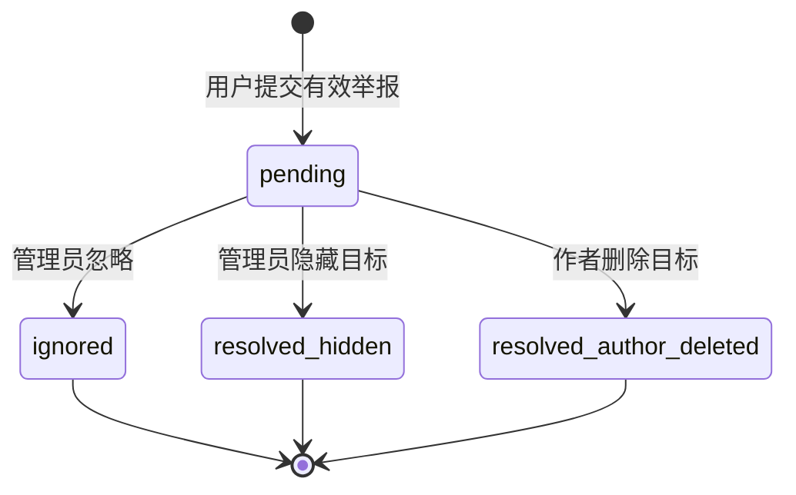

# 内容治理、权限与审计

## 1. 治理目标

治理功能要解决的不是“管理员能改任何数据”，而是让每一次内容限制都满足四个条件：授权明确、状态合法、并发唯一、结果可追溯。

第一版只处理帖子和评论的举报、隐藏与恢复。举报是用户提供的待审线索，不等于内容已经违规；管理员的处理结果必须独立记录，不能用删除举报来代替决策。

## 2. 角色与对象权限

全局角色只有普通用户 `user` 和管理员 `admin`。JWT 验证后只采用正数 int64 `sub`，再加载当前数据库用户的 `status/role`；Token 内旧的 role claim 不参与授权。圈子成员、内容作者、通知所有者属于对象权限，需要在每次用例中根据当前数据判断。所有资源 ID 同样是正数 int64。

| 动作 | 未登录 | 普通用户 | 管理员 | 额外对象条件 |
| --- | --- | --- | --- | --- |
| 浏览证券、公开圈子和可见帖子 | `401 unauthenticated` | 允许 | 允许 | 只返回 `visibility=visible AND deleted_at IS NULL` |
| 加入公开圈子 | `401 unauthenticated` | 允许 | 允许 | 重复加入返回同一关系 |
| 发帖、评论、回复 | `401 unauthenticated` | 允许 | 允许 | 必须是圈子成员，目标可见且未删除 |
| 删除帖子或评论 | `401 unauthenticated` | 仅作者 | 仅自己的普通内容 | 非作者 `403 forbidden`，不可见目标 `404 not_found` |
| 创建举报 | `401 unauthenticated` | 允许 | 允许 | 不存在、hidden、deleted 目标统一 `404 not_found` |
| 查看、处理举报 | `401 unauthenticated` | `403 forbidden` | 允许 | 相同决策重试 200，不同决策 409 |
| 恢复内容 | `401 unauthenticated` | `403 forbidden` | 允许 | 安全重试 200；不可恢复 409；不存在 404 |
| 查看管理员审计 | `401 unauthenticated` | `403 forbidden` | 允许 | 使用稳定分页 |
| 查看、标记通知 | `401 unauthenticated` | 仅本人 | 仅本人 | SQL 必须带当前 `user_id` |

管理员的治理能力不自动赋予其修改用户正文、读取他人通知或替作者删除内容的权限。

## 3. 内容有效状态

持久化使用两个互不覆盖的状态轴：

```text
作者轴：deleted_at IS NULL ──作者删除──> deleted_at 非空
治理轴：visibility=visible ──管理员隐藏──> hidden ──管理员恢复──> visible
```

有效状态规则：

- `deleted_at` 非空：无论 visibility 为何，都不允许普通读取、互动或恢复；
- `deleted_at` 为空且 `visibility=hidden`：普通读取和互动被阻止，管理员可恢复；
- `deleted_at` 为空且 `visibility=visible`：按成员和作者权限正常使用。

这种组合保留了动作主体：作者删除不能被管理员恢复，管理员隐藏也不会伪装成作者删除。

作者删除帖子或评论时，还必须在同一事务内把该目标的全部 `pending` 举报收口为
`resolved/author_deleted`，`decided_by` 保持空值，`decided_at` 使用服务端时间。该路径不是
管理员治理，因此不写 `admin_audit_logs`；它只负责防止治理队列残留无法再处理的待办。

## 4. 举报状态机



允许的迁移只有：

- `pending → ignored`：内容不变，对外追加 `report_ignored` 审计；
- `pending → resolved(hidden)`：目标从 `visible` 变为 `hidden`，追加 `content_hidden` 审计；
- `pending → resolved(author_deleted)`：作者删除目标时由系统收口，不写管理员审计。

OpenAPI 的 `ignore/ignored/report_ignored` 分别映射到数据库的 `resolution_action=dismiss`、`status=dismissed`、`action=report_dismissed`；这是协议与持久化命名映射，不是第二套状态。`ignored` 和 `resolved` 都是终态。相同决策重试读取并返回既有结果，不新增审计；不同决策返回 `409 report_already_decided`。

## 5. 创建举报

创建举报的调用链：

```text
POST /api/v1/reports
  → JWT 建立 reporter
  → Handler 严格解析 target_type、target_id、reason、details
  → Use Case 先按 reporter + 目标查重；已有举报立即返回原结果
  → 仅新举报加载并锁定帖子或评论
  → 校验目标可见、未删除且作者不是 reporter
  → Repository 写入 pending 举报
  → 首次返回 201；同一举报者/目标重复提交返回原 receipt 和 200
```

`target_type` 只能是 `post/comment`。真实举报者来自 JWT，请求体不得包含可决定归属的 `reporter_id`；举报自己的内容固定返回 `422 self_report_forbidden`。外部 `reason` 与 `reason_code` 一一对应为 `spam/harassment/misleading/illegal/other`；`details` 设长度上限并按普通文本处理。createReport 不要求 Idempotency-Key，数据库业务唯一键保证重复请求返回既有结果。查重必须早于目标可见性检查，确保目标后来隐藏时的网络重试仍返回原举报。

目标在校验后、写入前可能被治理。实现应在事务中重新确认可举报性，或接受外键后用条件写入保证最终状态；不能只依赖 Handler 中的预检查。

## 6. 处理举报的原子流程

管理员通过决策接口提交 OpenAPI 的 `ignore` 或 `hide`。核心事务顺序如下：

```text
BEGIN
  1. 读取举报快照以定位目标（此时不据此提交状态）
  2. 先锁定被举报的帖子或评论
  3. 再按 report.id 升序锁定该目标全部 pending 举报，并重新核对请求举报
  4. 若请求举报已终态：相同决策返回既有 200；不同决策返回 409
  5. hide 时确认内容可见且未删除，并令 moderation_version + 1
  6. ignore：当前举报写 dismissed/dismiss
     hide：内容写 hidden，并把同目标全部 pending 举报收口为 resolved/hide
  7. hide 时给内容作者写一条 actor 为空的 content_hidden 通知
  8. 写入一条不可变管理员审计
COMMIT
```

所有治理、作者删除和创建举报都遵守“目标优先、举报按 ID 升序”的同一锁顺序，避免两个管理员从不同举报进入时形成死锁环。MySQL 仍可能因其他资源顺序返回 1213/1205；用例只对整个事务做少量有界重试，绝不能从失败中间步骤继续。第二个事务等待首个提交后重新读取终态：决策相同就返回当前 `AdminReport` 和 200，决策不同就返回 `409 report_already_decided`。两种情况都不得覆盖首位处理人或生成第二条审计。

若步骤 3～6 任一步失败，整个事务回滚：不能出现举报已解决但内容仍可见，也不能出现状态改变却缺少审计。

## 7. 恢复内容

恢复接口为 `POST /api/v1/admin/content/{targetType}/{targetId}/restore`，仅管理员可调用：

```text
BEGIN
  1. 锁定目标内容
  2. 确认 target_type=post/comment、未删除，且 moderation_version 与请求期望一致
  3. 若 hidden：更新 visibility=visible、moderation_version + 1，不改 deleted_at
  4. 给内容作者写 actor 为空的 content_restored 通知
  5. 追加 content_restored 审计
COMMIT
```

恢复成功后使用相同期望版本直接重试时，若当前已 visible 且版本恰为 expected+1，服务依据既有恢复审计返回 200，不新增审计。若内容后来再次被隐藏，版本已经更高，旧重试返回 `409 moderation_version_conflict`，不能覆盖新的治理事实。从未被治理隐藏或已由作者删除返回 `409 content_not_restorable`；目标 ID 不存在返回 `404 not_found`。

恢复并不证明原举报错误，也不删除原审计；它只记录管理员在另一个时间点做出的新决定。

## 8. 审计记录

审计日志是追加式事实记录，至少回答：谁、何时、通过哪个请求、对什么目标、执行了什么动作、状态怎样变化、源自哪个举报。

应记录：

- 管理员用户 ID；
- 数据库动作 `report_dismissed`、`content_hidden` 或 `content_restored`；API 将第一项映射为 `report_ignored`；
- 数据库中的 `post_id/comment_id`，对外统一投影为 `target_type/target_id`；
- 相关举报 ID（如有）；
- `before_status/after_status`；
- 管理员说明 `reason`；
- Request ID 和 UTC 时间。

不应记录：

- JWT、Authorization Header、密码或连接串；
- 完整帖子、评论或举报正文；
- 为“方便排查”复制的用户敏感资料；
- 可被客户端伪造的管理员 ID 或角色。

审计查询按 `(created_at, id)` 稳定分页，筛选和响应统一使用 `target_type/target_id`。应用不提供修改和删除审计记录的 API。

## 9. 冲突与错误语义

| 场景 | 结果 |
| --- | --- |
| 未认证 | `401`，不进入治理用例 |
| 普通用户调用管理接口 | `403` |
| 举报或目标 ID 不存在 | `404 not_found` |
| 举报 hidden/deleted 目标 | `404 not_found` |
| 举报自己的内容 | `422 self_report_forbidden` |
| createReport 请求体的 `target_type` 非法 | `422 validation_failed` |
| 决策值不是 `ignore/hide` | `422 validation_failed` |
| restore 路径的 `targetType` 不是 `post/comment` | `400 invalid_request` |
| 已终态举报收到相同决策 | `200`，返回当前 AdminReport，不新增审计 |
| 已终态举报收到不同决策 | `409 report_already_decided` |
| 当前 visible 且版本恰为 expected+1 的直接恢复重试 | `200`，返回既有恢复结果，不新增通知/审计 |
| 旧恢复版本遇到后续治理版本 | `409 moderation_version_conflict` |
| 从未隐藏或作者已删除 | `409 content_not_restorable` |
| 恢复目标 ID 不存在 | `404 not_found` |
| 事务中的未知数据库错误 | 回滚并返回 `500 internal_error`，日志只记录安全上下文 |

稳定错误码用于客户端分支和测试；可读消息可以改善，但不能让测试依赖完整中文文案。

## 10. 并发与安全重试边界

- Idempotency-Key 只要求 createPost/createComment，治理依靠状态机识别安全重试；
- 相同 ignore/hide 重试返回既有 200，不重复状态变化或审计；不同决策返回 409；
- 恢复只在当前版本等于 expected 或 expected+1 时识别执行/直接重试；更高版本返回 ABA 冲突；
- reports 的业务唯一键使同一用户/目标的重复举报返回原 receipt 和 200；
- 行锁范围只覆盖正在处理的举报和目标内容，列表查询不得无故加排他锁；
- 在事务提交后写普通应用日志可以失败，但审计记录必须在事务中成功，否则治理动作回滚。

## 11. 必测场景

领域与用例测试：

- 每个允许和禁止的举报状态迁移；
- 非管理员在访问仓储前即被拒绝；
- ignore 不修改内容，hide 必须修改内容；
- 已删除内容不能隐藏或恢复；
- 任一仓储写入失败时事务回滚；
- 审计字段从服务端身份与旧/新状态生成，而非信任请求。

真实 MySQL 集成测试：

- 两个独立连接并发提交不同决策，恰好一次状态变化，另一请求为 409；并发相同决策可都返回 200，但审计仍只有一条；
- 更新举报后审计插入失败时全部回滚；
- hide 后内容从普通列表消失，restore 后重新出现；
- 举报互斥目标 CHECK 与两个外键生效；
- 审计分页在相同时间戳下稳定。

HTTP 黑盒验收：

```text
用户发帖 → 另一用户举报 → 管理员 hide
→ 普通用户无法读取 → 管理员看到审计
→ 管理员 restore → 普通用户再次可读取
```

验收只观察 HTTP 契约和最终状态，不导入 `reference` 内部包。

## 12. 值得写的中文注释

治理实现中的中文注释应集中解释：

- 为什么必须先锁目标，再按 ID 锁定并检查同目标 `pending` 举报；
- 为什么状态更新与审计必须共用事务；
- 为什么恢复不能改写原举报；
- 为什么作者删除只写 `deleted_at`，治理只写 `visibility`；
- 为什么相同治理重试返回既有 200，而相反决策返回 409。

不需要注释 SQL 每个关键字、每次 `if err != nil` 或每个字段赋值。清晰命名和小函数负责说明“做什么”，注释补充“如果换一种顺序会破坏什么”。
